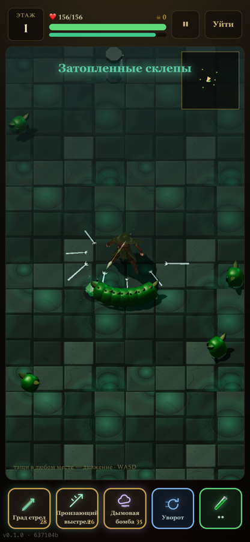
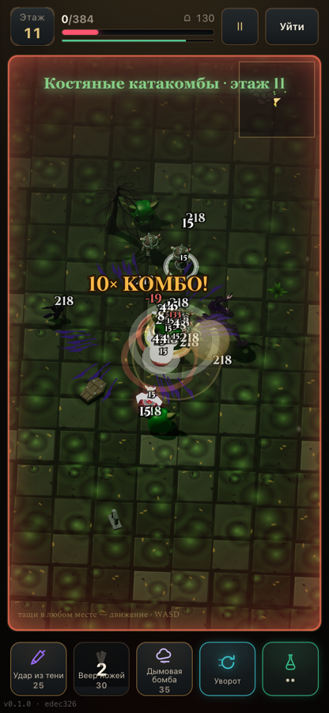
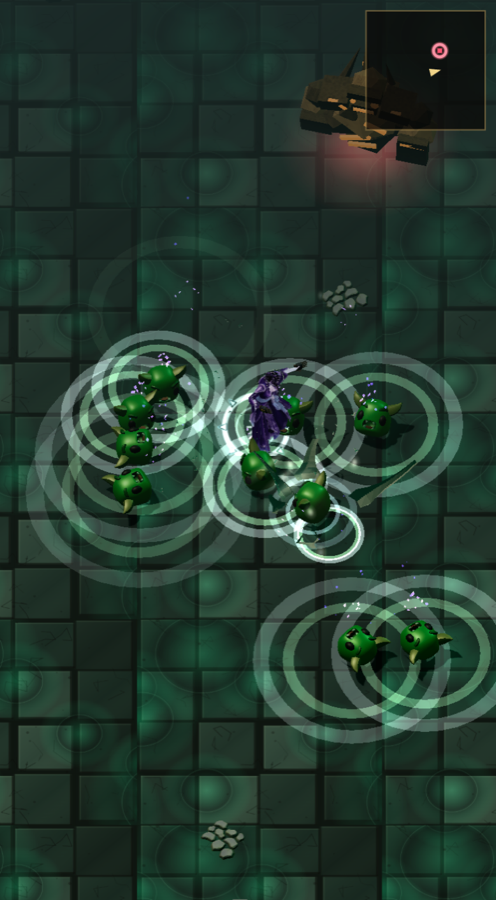

# RELICWORN

**A 3D fantasy action RPG that runs inside Telegram.**

No install, no store, no download screen — a player taps a link in a chat and is in a
dungeon a few seconds later, on a phone, in a WebView, at 60 frames per second.

RELICWORN is a solo-developed Telegram Mini App: a real-time dungeon crawler with seven
playable heroes, procedurally routed floors, authored 3D environments, an item and
progression economy, seasonal leaderboards and server-verified runs.

> This repository is a **public showcase** — architecture notes, engineering write-ups and
> standalone code extracts. The production source lives in a **private repository**; see
> [Repository policy](#repository-policy).

---

## Screenshots

| Exploration — Floor 1 | Combat — Floor 11 | Skill VFX |
|---|---|---|
|  |  |  |

Real frames captured from the running game at the Telegram Mini App portrait resolution.
The UI is in Russian — the game ships Russian-first with an i18n layer underneath.

---

## What makes it technically interesting

Shipping a 3D game into a Telegram WebView is a different problem from shipping a 3D game.
The constraints drove most of the engineering:

- **A phone WebView, not a game console.** One GPU context, a hard memory ceiling, a
  browser that will drop the context if you overreach, and a player who closes the app if
  the first frame is slow. Asset budgets are enforced in bytes, not in vibes.
- **The client cannot be trusted.** It is a leaderboard game, so a score arriving from a
  phone is a claim, not a fact. The simulation is deterministic and replayable, so the
  server can re-run a submitted run and compare.
- **The network is a mobile network.** Saves conflict, rate-limit, time out and arrive out
  of order. Progress loss is the one bug players never forgive, so the save path has its own
  contract, its own tests and its own failure taxonomy.
- **Portrait, one thumb.** A 372×682 CSS canvas is the whole screen. Every element that
  matters in combat has to be readable at that size, at combat speed, without the player
  studying it.

---

## Tech stack

| Layer | Choice |
|---|---|
| **Language** | TypeScript (strict) |
| **Rendering** | Three.js — custom render loop, GLTF/GLB pipeline, authored floor plates |
| **UI** | React 19, Zustand for state, Tailwind CSS 4 |
| **Build** | Vite 8 |
| **Backend** | Serverless functions on Vercel |
| **Database** | PostgreSQL with row-level security |
| **Platform** | Telegram Mini App + Telegram Bot |
| **Testing** | Vitest (unit + simulation), Playwright (end-to-end and frame capture) |
| **Asset pipeline** | Blender (headless, scripted), `gltf-transform`, deterministic batch builds |

Roughly **150,000 lines** of TypeScript across the client, simulation and serverless layer,
with **286 test files** covering the parts that are expensive to get wrong.

---

## Implemented systems

### Gameplay

- **Real-time combat simulation** on a fixed tick, decoupled from the render loop, so
  frame drops change how the game looks and never what it computes.
- **Seven playable heroes** — paladin, sorceress, necromancer, barbarian, huntress, druid,
  assassin — each with its own skill set, energy identity and animation set, not a recoloured
  shared kit.
- **Progression of depth:** ten leagues of fifteen floors, with a floor lord every league
  and a Seal Guardian at the end of it.
- **Boss encounters** built as self-contained modules — identity, arena, AI, combat, loot,
  audio and VFX per boss, registered rather than hard-coded.
- **35 authored rooms**: each one a hand-built floor plate with its own construction,
  relief and palette, routed procedurally so a run never plays the same order twice.
- **Items, equipment and reforging**, with an attribute system, gem sockets, iconic effects
  and rules for what a swap actually displaces.
- **Economy and hunts** — currencies, a ledger, timed events, seasonal rewards.

### Platform and services

- **Deterministic, server-verifiable runs.** A run is a seed plus an input stream; the
  server replays it. See [`examples/src/deterministicRng.ts`](examples/src/deterministicRng.ts).
- **A save path with a written contract:** at most one write in flight, coalescing behind
  it, server-directed backoff, and exactly one authoritative reconciliation per revision
  conflict. See [`examples/src/singleFlightSave.ts`](examples/src/singleFlightSave.ts).
- **Seasonal leaderboards** with registration on save and season rollover.
- **Referral attribution and retention reporting** — D1/D7/D30 measured from a run journal.
- **Telegram-native bot** for onboarding, notifications and community routing.
- **Telegram Stars payments** for the in-game pass.
- **Feature flags and a staged release path**, so a change can be dark-launched and rolled
  back to a known commit.

### Rendering and art pipeline

- **Byte-budgeted GPU asset cache with eviction leases** — the cap is memory, not entry
  count, and an asset on screen cannot be evicted.
  See [`examples/src/byteBudgetCache.ts`](examples/src/byteBudgetCache.ts).
- **Headless Blender build pipeline:** Python source → scripted headless build → manifest
  and hash → GLB. The same input produces the same binary, which is what makes an asset
  reviewable.
- **Frame-accurate visual QA:** a Playwright harness captures real frames from the running
  game on a GPU, at fixed camera positions, and measures them — so a visual regression is
  caught by a number, not by memory.
- **Texture budgets expressed in device pixels**, because a 2× display is what the player
  actually has.

---

## Architecture overview

```
┌─────────────────────────── Telegram client (WebView) ───────────────────────────┐
│                                                                                 │
│   React 19 UI  ──────────────┐                                                  │
│   screens, HUD, inventory    │                                                  │
│                              ▼                                                  │
│                        Zustand store  ◄────────┐                                │
│                              │                 │                                │
│              ┌───────────────┴────────┐        │                                │
│              ▼                        ▼        │                                │
│     Simulation (pure)          Three.js renderer│                               │
│     fixed tick, seeded RNG     scene graph, VFX │                               │
│     no Date, no Math.random    asset cache ─────┘                               │
│              │                                                                  │
│              │ run input (seed + actions)                                       │
└──────────────┼──────────────────────────────────────────────────────────────────┘
               │  save queue: single-flight, coalescing, backoff
               ▼
┌─────────────────────────── Serverless functions ────────────────────────────────┐
│   auth · save/load (CAS on revision) · leaderboard · progression · economy       │
│   run verification (replays the same pure simulation)                           │
└──────────────┬──────────────────────────────────────────────────────────────────┘
               ▼
┌─────────────────────────── PostgreSQL (row-level security) ─────────────────────┐
│   accounts · saves (revisioned) · seasons · ledger · run journal · attribution   │
└─────────────────────────────────────────────────────────────────────────────────┘
```

The load-bearing idea is the line between **simulation** and **presentation**. The
simulation is pure TypeScript with no renderer, no clock and no randomness of its own; the
renderer reads from it and never writes back. That is what lets the same code run on a
player's phone and on a server that has no GPU.

A longer write-up: [`docs/ARCHITECTURE.md`](docs/ARCHITECTURE.md).

### Project structure (production repository)

```
src/
  game/          simulation, heroes, bosses, items, progression, economy, RNG
    __tests__/   184 test files covering the rules that must not drift
    bosses/      one module per boss: identity, arena, ai, combat, loot, vfx
    items/       definitions, equip rules, reforging, iconic effects
  ui/            React screens, HUD, inventory, hero view
  audio/         music and SFX layer with attribution tracking
api/             serverless endpoints
db/              SQL schema, RLS policies, migrations
art/             Blender sources and build scripts for authored assets
tools/           asset pipeline, visual QA harness, performance capture
e2e/             Playwright end-to-end flows
docs/            engineering constitution, roadmaps, decision records
```

---

## Code examples

Three standalone extracts, each with the reasoning that produced it and a test suite that
runs on its own:

| Example | What it demonstrates |
|---|---|
| [`deterministicRng.ts`](examples/src/deterministicRng.ts) | Seeded PRNG, weighted selection, and the replay check that makes a leaderboard score verifiable |
| [`singleFlightSave.ts`](examples/src/singleFlightSave.ts) | A save queue that survives 409 conflicts, 429 rate limits and gateway timeouts without losing progress |
| [`byteBudgetCache.ts`](examples/src/byteBudgetCache.ts) | An LRU cache capped in bytes, with leases so a visible asset is never evicted |

```bash
cd examples
npm install
npm test
```

These are rewritten for clarity and carry no production endpoints, credentials or
proprietary rules — they demonstrate the pattern, not the implementation.

---

## Development status

**Live in production.** RELICWORN is playable in Telegram and has real players.

| Area | Status |
|---|---|
| Core loop — run, combat, floors, death, rewards | Shipped |
| Seven heroes with distinct kits | Shipped |
| Boss encounters and league progression | Shipped |
| Items, equipment, reforging, gems | Shipped |
| Save/load with conflict resolution | Shipped — hardened over several release cycles |
| Seasonal leaderboards | Shipped |
| Referral attribution and retention reporting | Shipped |
| Telegram Stars payments | Shipped |
| Native Telegram bot | Shipped |
| 35 authored rooms | Shipped |
| Camera and HUD rework for portrait | In progress |
| Audio vertical slice | In progress |
| Animation pipeline for authored creatures | In progress |
| Additional leagues and boss roster expansion | Planned |

Development is continuous, with a staged release process: every change goes to a preview
build first, then to production behind a flag, with a named rollback commit recorded before
the deploy.

---

## Engineering practice

A few conventions that shaped this project more than any framework choice:

- **A change is not done because it compiles.** It is done when there is evidence — a
  captured frame, a measured number, a test that fails without the fix.
- **The author of a change is not its first reviewer.** Anything claiming to be finished
  gets an adversarial pass whose job is to disprove it.
- **Measurements carry their instrument.** A number without the conditions that produced it
  is not a result; a performance claim from a backgrounded browser tab is not a result at all.
- **Rollback is decided before the deploy, not after the incident.**
- **Frozen contracts.** Simulation determinism, replay compatibility and the save format are
  explicitly frozen; changing one requires a scoped migration, not a patch.

---

## Repository policy

The production source for RELICWORN is a **private repository** and stays private. It holds
live service credentials, payment and anti-abuse logic, database schemas and policies, and
commissioned art assets.

This showcase contains only material that is safe to publish:

- written architecture and engineering notes,
- standalone code extracts, rewritten for clarity and free of production internals,
- screenshots of the running game.

Nothing here contains credentials, API keys, tokens, connection strings, private URLs,
schema definitions or security logic. The contents are scanned before every publish.

---

## Assets and credits

- 3D assets shown in the screenshots are either **CC0 1.0** library models or assets
  **authored for this project** (Blender sources, or generated to the project's own briefs).
  No third-party asset files are redistributed in this repository.
- Audio in the game is CC0 and CC-BY, credited in-game as the licences require. Audio files
  are not included here.
- The example code in [`examples/`](examples) is released under the MIT licence
  ([LICENSE](LICENSE)). The game itself, its art and its content are not open source.

---

## Author

**Vladimir Yussupov** — solo developer: design, engineering, 3D pipeline, backend and
release operations.

GitHub: [@vladimir-yussupov81](https://github.com/vladimir-yussupov81)
